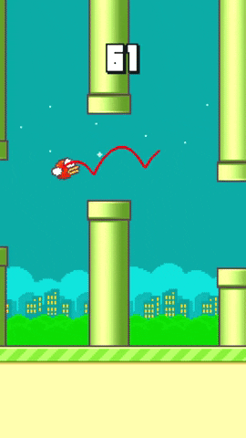

FlapPyBird-MPC
===============

A Mixed Integer Programming model predictive controller for a [Flappy Bird Clone](https://github.com/sourabhv/FlapPyBird). The meat of the controller is found in `mip.py`. Most of the rest is unmodified from the original flappy bird clone.

Blog posts describing the approach can be found here:

- http://www.philipzucker.com/flappy-bird-as-a-mixed-integer-program/
- http://blog.benwiener.com/programming/2019/10/06/flappy-bird-mpc.html

We wrote a controller for the 2013 smash-hit game Flappy Bird using a model predictive control approach where the model is phrased as a mixed integer program. You can see the result in the above video. The red line shows our controller's planned route, which changes as new obstacles come into view. I'll break this all down a little bit.

Model predictive control is a method of control where you model the system out to a finite horizon and optimize the trajectory with respect to the series of inputs. Then you act according to the first step in your optimal input and repeat the process at the next time step with a little bit of new information.

We expressed the model as a mixed integer linear program, an optimization problem with linear constraints and objective functions where all or some of the variables can be integers or booleans. In this case, the constraints impose both the physics of the game—ballistic motion with discrete impulses from flaps—and the objective of avoiding the pipes, floor, and ceiling. The input in this case are a series of booleans describing whether or not the bird jumps in each time step. We implemented the model in CVXPY, a Python package and domain-specific modeling language for convex optimization problems.

We forked Sourabh Verma's Pygame implementation of Flappy Bird and hacked it up a bit. At each time step, Flappy Bird calls our function for input. It passes the current state to our controller, which updates the initial conditions and pipe positions, solves for a trajectory, and returns the first action from its optimal input.

This technique works pretty well. It doesn't quite run in real time with the lookahead set to a distance that allows it to succeed. We used a neat trick to improve the speed and look ahead distance. The model's time step increases with look ahead time. In other words, the model is precise for its first few time steps, and gets less careful later in its prediction. The thinking is that this allows it to make approximate long term plans about jump timing without over-taxing the solver. 

How-to (as tested on MacOS)
---------------------------

1. Install pygame, cvxpy, gurobi, numpy. 
2. `python flappy.py` hit space and watch her go.
